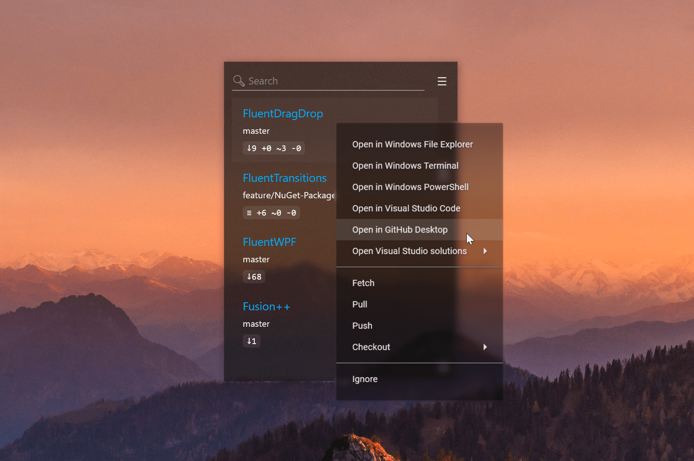

> # Work in progress

# Repository Actions for RepoZ

This repository contains action definitions for the context menu in RepoZ.

Name your json file `RepositoryActions.json` and put in in the RepoZ configuration folder:

- Windows: `C:\Users\YOURUSERNAME\AppData\Roaming\RepoZ` (`%APPDATA%\RepoZ`)
- macOS: `/users/YOURUSERNAME/.config/RepoZ`
